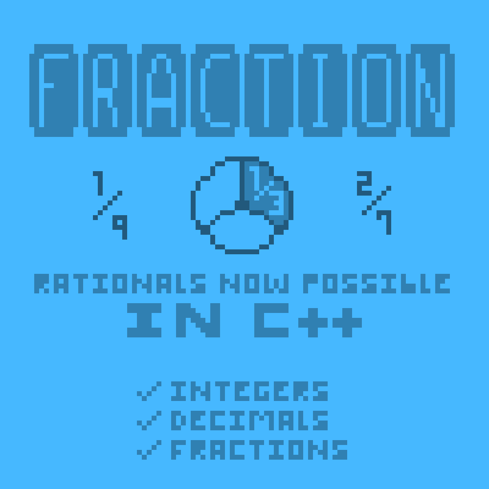

# Fraction Data Structure
This project builds a data structure that can behave as a fraction, with operations between Fraction objects through operator overloading and conversions from a Fraction object to a decimal value through member functions.
 
**(Features listed below)**
  

  
## Features
- Arithmetic operations between Fraction objects (e.g. addition, subtractions, multiplication, division, powers, etc.)
- Logical operations (comparisons) between Fraction objects (e.g. greater than, greater than or equal to, less than, less than or equal to, equal to, not equal to, etc.)
- Ability to get the GCF of the numerator value and denominator value of a Fraction object.
- Ability to simplify the fraction value.
- Converting fraction to a decimal value, converting decimal value to a fraction.
- And More...
